# 💼 Thejaswini's React Portfolio

Welcome to my portfolio! This is a personal portfolio website built using **React.js**, styled with **CSS**, and deployed using **GitHub Pages**. It showcases my skills, projects, achievements, and resume in a clean and responsive manner.


## 📌 Live Website

🔗 [View My Portfolio](https://theju1212.github.io/My_ReactPortfolio/)


## 💡 Project Overview

This React portfolio project was developed as a part of NRKS Skill Development Private Limited training program. It includes all the required sections and follows best practices for responsiveness, code structure, and deployment.


## 🚀 Technologies Used

- React.js (Frontend Library)
- CSS (Styling)
- HTML (Structure via JSX)
- Git & GitHub (Version Control)
- GitHub Pages (Deployment)

---

## 📁 Folder Structure
My_ReactPortfolio/
├── client/ # React frontend
│ ├── public/
│ ├── src/
│ │ ├── components/
│ │ ├── assets/
│ │ │ └── screenshots/
│ │ ├── App.js
│ │ ├── index.js
│ │ └── styles/
│ ├── package.json
│ ├── README.md
│ └── .gitignore
├── server/ # Backend server 
│ ├── index.js / app.js
│ ├── routes/
│ └── package.json
├── .gitignore
└── README.md # This file


## 🔧 Technologies Used

- **Frontend:** React.js, CSS
- **Backend:** Node.js (Express.js)
- **Version Control:** Git & GitHub
- **Deployment:** GitHub Pages (for frontend)
- **Optional Tools:** GitHub Actions, dotenv


## ✨ Features Implemented

### 1. **Home / Intro Section**
- Name, tagline, professional photo
- Typing animation

### 2. **About Me**
- Career objective, personality highlights

### 3. **Education**
- Degree, institution, year, CGPA

### 4. **Technical Skills**
- Programming languages, tools, libraries

### 5. **Projects**
-  projects with descriptions and GitHub/demo links

### 6. **Certifications / Trainings**
- NRKS training and others

### 7. **Internship / Work Experience**
- Role, company, responsibilities

### 8. **Achievements / Awards**
- Hackathon participation, volunteering, recognitions

### 9. **Contact Section**
- Contact form with validation (connected to backend)
- Email, GitHub, LinkedIn

---

## 🎁 Bonus Features

- ✅ Responsive across devices
- ✅ Typing animation
- ✅ Structured with clean code & components


### 🏠 Home Section
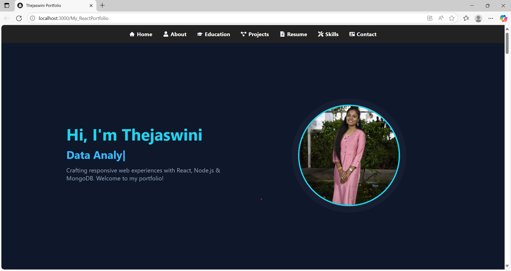

### 👩‍💼 About Me Section
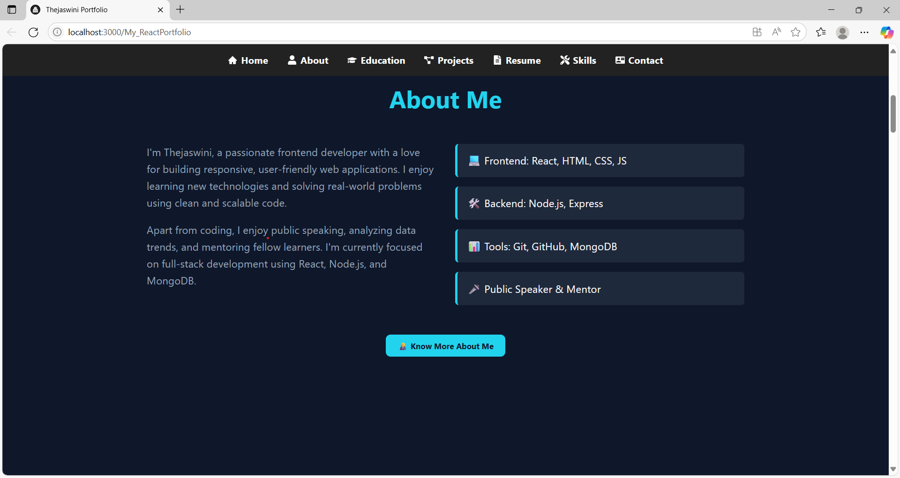

### 🎓 Education Section
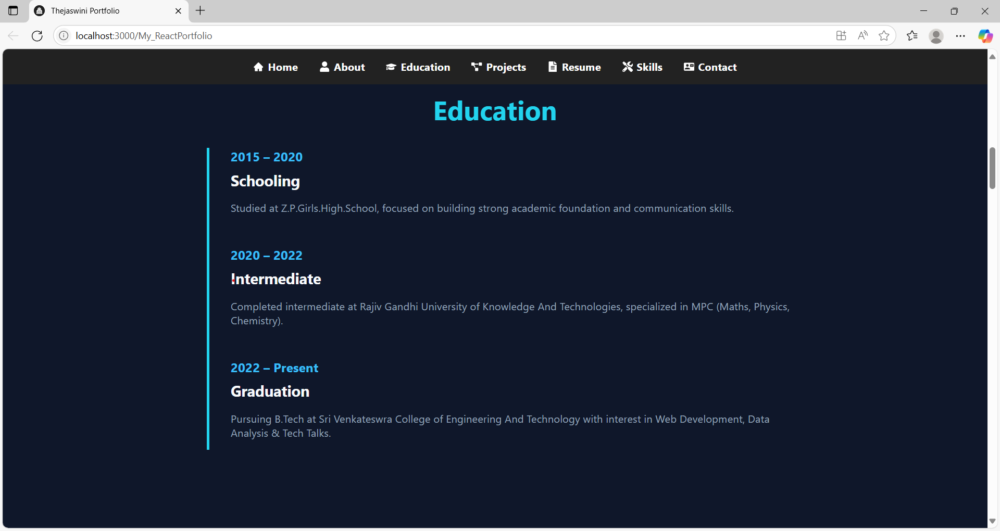

### 🛠️ Skills Section
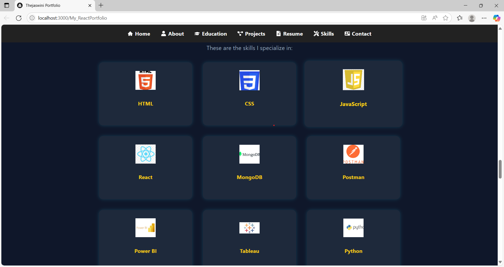

### 🏆 Achievements Section
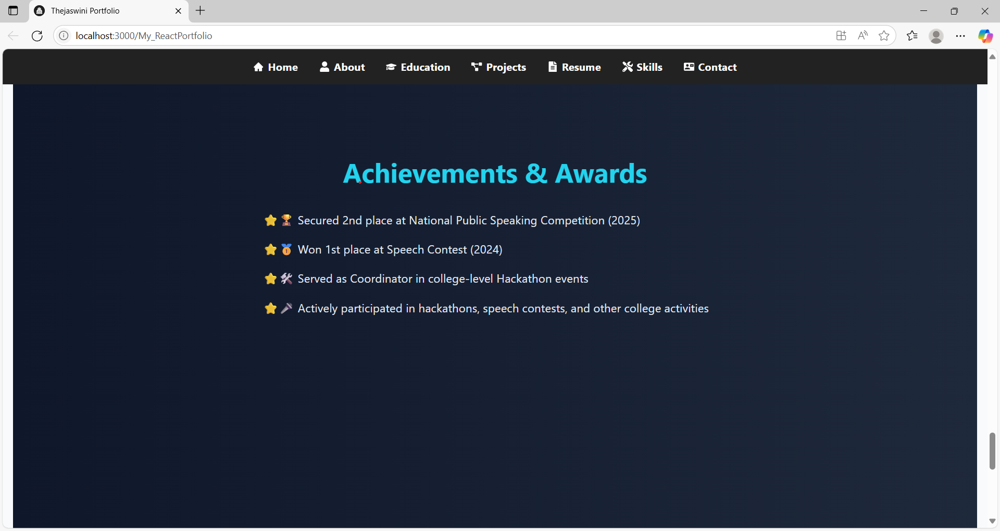

### 📜 Certifications Section
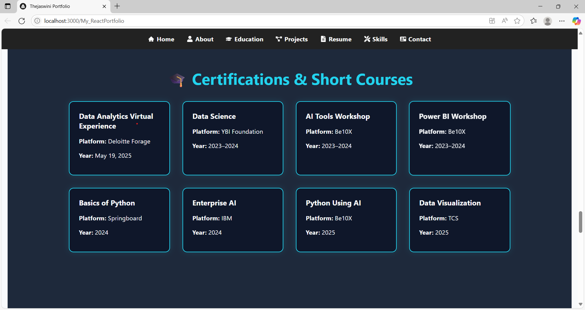

### 💼 Internships Section
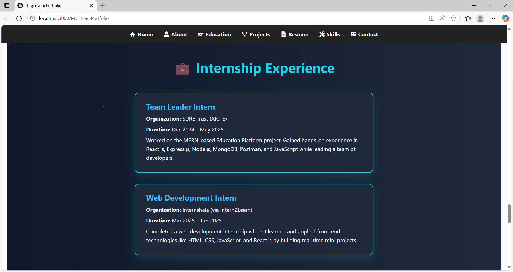

### 💻 Projects Section
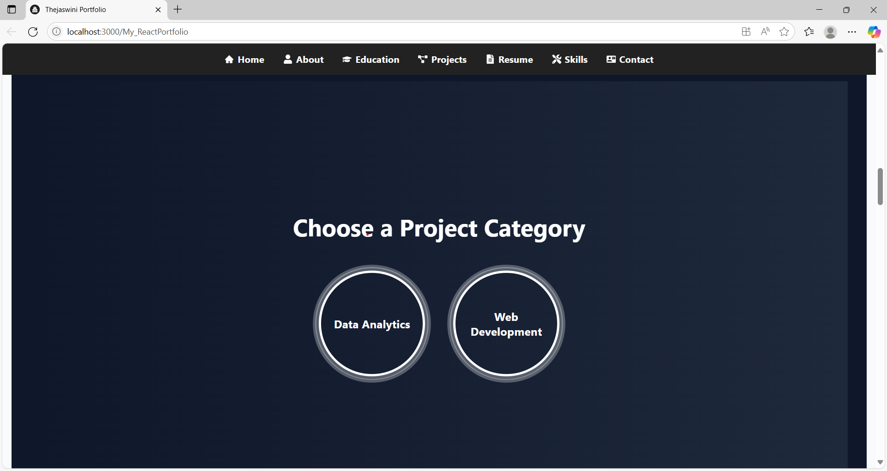
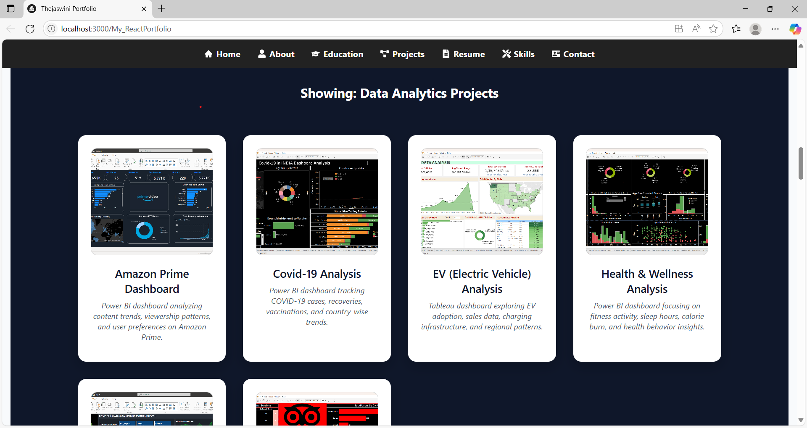
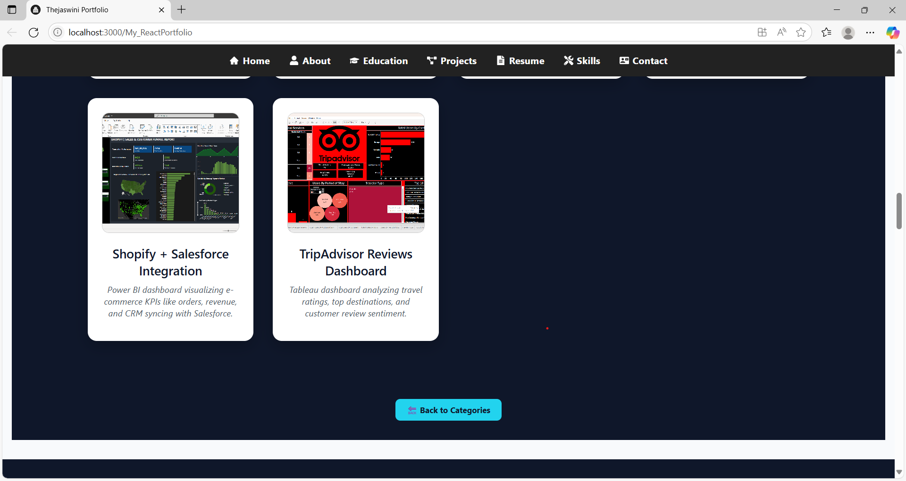

### 📄 Resume Section
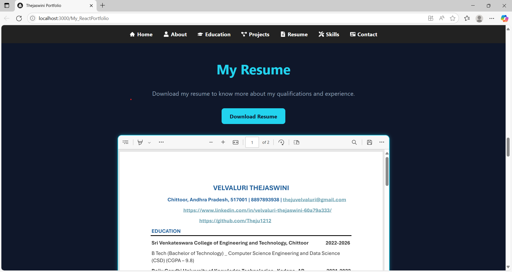

### 📞 Contact Section
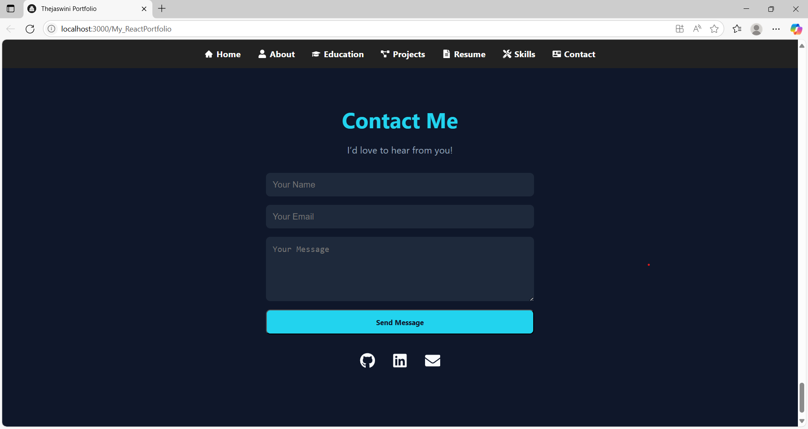


## 🚀 How to Run Locally

### 🔹 Frontend (React)

```bash
cd client
npm install
npm start
